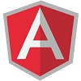

### Hello I'm Hugo 😄

#### About me 💬

* Another travel fan ✈
* Full-Stack Developer at @heptaward
* Javascript Lover
* NodeJs fan
* AngularJs nostalgic (yes Js)
* More activities on my Gitlab account: https://gitlab.com/hugoLarrousse

<!--
**hugoLarrousse/hugoLarrousse** is a ✨ _special_ ✨ repository because its `README.md` (this file) appears on your GitHub profile.

Here are some ideas to get you started:

- 🔭 I’m currently working on ...
- 🌱 I’m currently learning ...
- 👯 I’m looking to collaborate on ...
- 🤔 I’m looking for help with ...
- 💬 Ask me about ...
- 📫 How to reach me: ...
- 😄 Pronouns: ...
- ⚡ Fun fact: ...
-->

#### My main stack 🔭

#### Contact 📫

linkedin: https://www.linkedin.com/public-profile/in/hugo-larrousse
